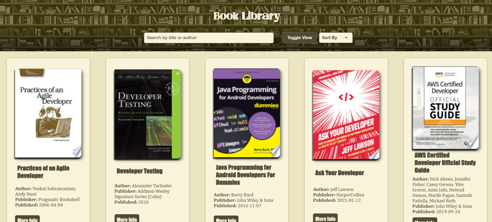
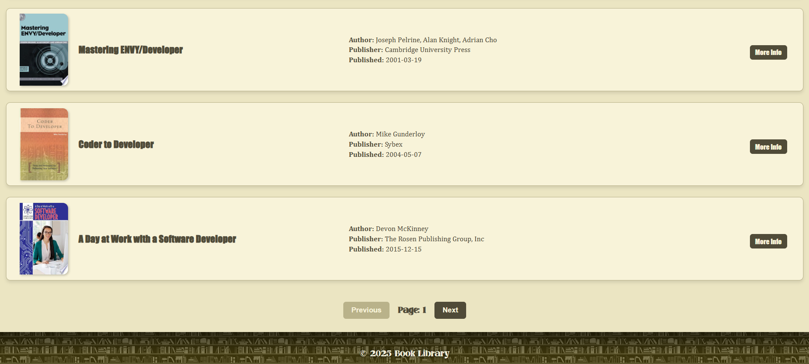

# 📚 Book Explorer

A web application to search, browse, and explore books fetched from an external API. Users can switch between list and grid views, filter, sort, and paginate through book collections.

## 🌟 Features

- **Dynamic Book Display**: Fetch and display books from API in list/grid format
- **Flexible Views**: Toggle between list and grid layouts
- **Comprehensive Details**: View book information including:
  - Title
  - Author
  - Publisher
  - Published Date
  - Cover Thumbnail
- **Search Functionality**: Find books by title or author
- **Advanced Sorting**: Organize books by:
  - Alphabetical order
  - Publication date
- **Smooth Pagination**: Load more books as you scroll
- **Detailed Information**: Click any book to open full details in a new tab
- **📱 Responsive Design**: Optimized for all devices and screen sizes

## 🛠️ Technical Stack

- HTML5/CSS3
- JavaScript
- External Books API Integration
- Responsive Design Principles

## 🎯 Key Takeaways

- **API Integration**: Gained hands-on experience with RESTful API integration and data handling
- **UI/UX Design**: Implemented user-friendly interfaces with multiple view options
- **Performance Optimization**: Managed efficient data loading through pagination
- **Responsive Development**: Created adaptive layouts for various screen sizes
- **State Management**: Handled complex state changes between different views and sorting options